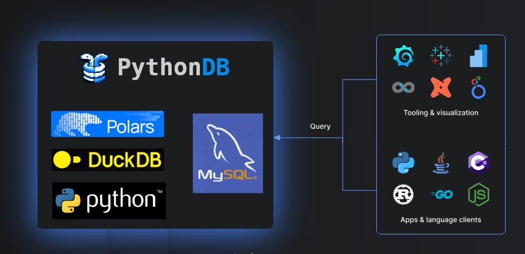

# MyPythonDB - Python as a Database



Python is at the heart of most data analysis but to share analysis's most users have been uploading data to SQL databases, until now.
MyPythonDB turns your python instance into an SQL database. Existing tools can query data directly at faster than database speeds.

- PythonDB provides a MySQL interface that allows every BI tool to just work.
- With DuckDB and Polars-SQL you can directly query in-memory dataframes, S3 or on-disk parquet files using SQL.
- Via the simple SQL editor web interface, you can share links to results with colleagues.

Modern tools and libraries are arriving and providing capabilities and performance only previously available accessible by paying for 
huge enterprise licenses $$$. Given these changes, We believe data analysts will increasingly be performed using these tools in future.

## Uses

1. Import package to expose your python instance as a MySQL Database.
2. pythondb.exe mydb.duckdb - Load a duckdb database and make it remotely accessible.
3. pythondb - A new in-memory duckdb instance
4. pythondb --language polars --language polars - A polars instance

### Python as MySQL

```
import mypythondb

mypythondb.start(port=3145, webport=9090, language='POLARS')
```

## Command Line Options

```
Options:
  -l, --language LANG    Language to interpret code as.  [default: PYTHON]
  -c, --command COMMAND  Run COMMAND
  -P, --port SQLPORT     Port for MySQL compatible server to listen on
  -w, --webport WEBPORT  Port for webserver to listen on
  -q, --quiet            Quiet, don't show banner
  -v, --verbose          Display debugging information
  --version              Show the version and exit.
  --help                 Show this message and exit.
```

# Development Info

### Facts

- **Python** is the language for data analysis.
- **Polars** / **DuckDB** provides extremely fast DataFrame operations previously only accessible at great cost.
- Many libraries and databases are converging on common data formats
    - Apache **Arrow** in memory
    - Apache **Parquet** on disk


# Dev Commands
```
poetry install --sync
poetry lock
poetry run pythondb
poetry run pytest
poetry run pyinstaller --onefile launcher.py --icon html\favicon.ico --name pythondb --add-data html;html
```
